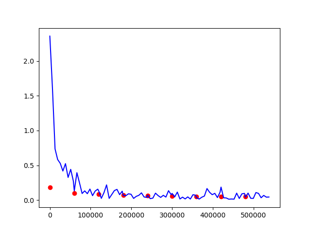

# MNIST Handwritten digit recogntion

## Dataset
We will be using the MNIST dataset. It contains 70,000 images of handwritten digits: 60,000 
for training and 10,000 for testing. The images are grayscale, 28x28 pixels, and centered to
reduce preprocessing and get started quicker.

##### hyperparameters
```
learning_rate = 0.01
momentum = 0.5
```

#### Training the model

We train the model for 9 epochs:

```GPU Available
/home/souranil/anaconda3/lib/python3.8/site-packages/torchvision/datasets/mnist.py:498: UserWarning: The given NumPy array is not writeable, and PyTorch does not support non-writeable tensors. This means you can write to the underlying (supposedly non-writeable) NumPy array using the tensor. You may want to copy the array to protect its data or make it writeable before converting it to a tensor. This type of warning will be suppressed for the rest of this program. (Triggered internally at  /pytorch/torch/csrc/utils/tensor_numpy.cpp:180.)
  return torch.from_numpy(parsed.astype(m[2], copy=False)).view(*s)
/home/souranil/anaconda3/lib/python3.8/site-packages/torch/nn/functional.py:718: UserWarning: Named tensors and all their associated APIs are an experimental feature and subject to change. Please do not use them for anything important until they are released as stable. (Triggered internally at  /pytorch/c10/core/TensorImpl.h:1156.)
  return torch.max_pool2d(input, kernel_size, stride, padding, dilation, ceil_mode)
/home/souranil/ai/research/MNIST/model.py:22: UserWarning: Implicit dimension choice for log_softmax has been deprecated. Change the call to include dim=X as an argument.
  return F.log_softmax(out)
Train Epoch: 1 [0/60000 (0%)]   Loss: 2.304569
Train Epoch: 1 [6400/60000 (11%)]       Loss: 0.377241
Train Epoch: 1 [12800/60000 (21%)]      Loss: 0.298821
Train Epoch: 1 [19200/60000 (32%)]      Loss: 0.212670
Train Epoch: 1 [25600/60000 (43%)]      Loss: 0.131693
Train Epoch: 1 [32000/60000 (53%)]      Loss: 0.289687
Train Epoch: 1 [38400/60000 (64%)]      Loss: 0.133055
Train Epoch: 1 [44800/60000 (75%)]      Loss: 0.180208
Train Epoch: 1 [51200/60000 (85%)]      Loss: 0.024617
Train Epoch: 1 [57600/60000 (96%)]      Loss: 0.101688
/home/souranil/anaconda3/lib/python3.8/site-packages/torch/nn/_reduction.py:42: UserWarning: size_average and reduce args will be deprecated, please use reduction='sum' instead.
  warnings.warn(warning.format(ret))

Test set: Avg. loss: 0.0578, Accuracy: 9820/10000 (98%)

Train Epoch: 2 [0/60000 (0%)]   Loss: 0.111114
Train Epoch: 2 [6400/60000 (11%)]       Loss: 0.038455
Train Epoch: 2 [12800/60000 (21%)]      Loss: 0.040700
Train Epoch: 2 [19200/60000 (32%)]      Loss: 0.028033
Train Epoch: 2 [25600/60000 (43%)]      Loss: 0.057267
Train Epoch: 2 [32000/60000 (53%)]      Loss: 0.059664
Train Epoch: 2 [38400/60000 (64%)]      Loss: 0.033440
Train Epoch: 2 [44800/60000 (75%)]      Loss: 0.087093
Train Epoch: 2 [51200/60000 (85%)]      Loss: 0.121240
Train Epoch: 2 [57600/60000 (96%)]      Loss: 0.004950

Test set: Avg. loss: 0.0390, Accuracy: 9887/10000 (99%)

Train Epoch: 3 [0/60000 (0%)]   Loss: 0.164611
Train Epoch: 3 [6400/60000 (11%)]       Loss: 0.017368
Train Epoch: 3 [12800/60000 (21%)]      Loss: 0.018954
Train Epoch: 3 [19200/60000 (32%)]      Loss: 0.034486
Train Epoch: 3 [25600/60000 (43%)]      Loss: 0.044361
Train Epoch: 3 [32000/60000 (53%)]      Loss: 0.044434
Train Epoch: 3 [38400/60000 (64%)]      Loss: 0.011981
Train Epoch: 3 [44800/60000 (75%)]      Loss: 0.003335
Train Epoch: 3 [51200/60000 (85%)]      Loss: 0.086176
Train Epoch: 3 [57600/60000 (96%)]      Loss: 0.056804

Test set: Avg. loss: 0.0316, Accuracy: 9895/10000 (99%)

Train Epoch: 4 [0/60000 (0%)]   Loss: 0.037551
Train Epoch: 4 [6400/60000 (11%)]       Loss: 0.021228
Train Epoch: 4 [12800/60000 (21%)]      Loss: 0.061708
Train Epoch: 4 [19200/60000 (32%)]      Loss: 0.008180
Train Epoch: 4 [25600/60000 (43%)]      Loss: 0.018432
Train Epoch: 4 [32000/60000 (53%)]      Loss: 0.021855
Train Epoch: 4 [38400/60000 (64%)]      Loss: 0.002336
Train Epoch: 4 [44800/60000 (75%)]      Loss: 0.006159
Train Epoch: 4 [51200/60000 (85%)]      Loss: 0.095321
Train Epoch: 4 [57600/60000 (96%)]      Loss: 0.036353

Test set: Avg. loss: 0.0285, Accuracy: 9905/10000 (99%)

Train Epoch: 5 [0/60000 (0%)]   Loss: 0.001487
Train Epoch: 5 [6400/60000 (11%)]       Loss: 0.072225
Train Epoch: 5 [12800/60000 (21%)]      Loss: 0.029285
Train Epoch: 5 [19200/60000 (32%)]      Loss: 0.001919
Train Epoch: 5 [25600/60000 (43%)]      Loss: 0.004640
Train Epoch: 5 [32000/60000 (53%)]      Loss: 0.038650
Train Epoch: 5 [38400/60000 (64%)]      Loss: 0.033590
Train Epoch: 5 [44800/60000 (75%)]      Loss: 0.004456
Train Epoch: 5 [51200/60000 (85%)]      Loss: 0.006470
Train Epoch: 5 [57600/60000 (96%)]      Loss: 0.003912

Test set: Avg. loss: 0.0328, Accuracy: 9890/10000 (99%)

Train Epoch: 6 [0/60000 (0%)]   Loss: 0.000496
Train Epoch: 6 [6400/60000 (11%)]       Loss: 0.117431
Train Epoch: 6 [12800/60000 (21%)]      Loss: 0.037270
Train Epoch: 6 [19200/60000 (32%)]      Loss: 0.071375
Train Epoch: 6 [25600/60000 (43%)]      Loss: 0.242962
Train Epoch: 6 [32000/60000 (53%)]      Loss: 0.003304
Train Epoch: 6 [38400/60000 (64%)]      Loss: 0.056293
Train Epoch: 6 [44800/60000 (75%)]      Loss: 0.002449
Train Epoch: 6 [51200/60000 (85%)]      Loss: 0.002915
Train Epoch: 6 [57600/60000 (96%)]      Loss: 0.043637

Test set: Avg. loss: 0.0335, Accuracy: 9895/10000 (99%)

Train Epoch: 7 [0/60000 (0%)]   Loss: 0.028601
Train Epoch: 7 [6400/60000 (11%)]       Loss: 0.042024
Train Epoch: 7 [12800/60000 (21%)]      Loss: 0.027095
Train Epoch: 7 [19200/60000 (32%)]      Loss: 0.003084
Train Epoch: 7 [25600/60000 (43%)]      Loss: 0.037349
Train Epoch: 7 [32000/60000 (53%)]      Loss: 0.056577
Train Epoch: 7 [38400/60000 (64%)]      Loss: 0.031037
Train Epoch: 7 [44800/60000 (75%)]      Loss: 0.002284
Train Epoch: 7 [51200/60000 (85%)]      Loss: 0.005752
Train Epoch: 7 [57600/60000 (96%)]      Loss: 0.029922

Test set: Avg. loss: 0.0307, Accuracy: 9903/10000 (99%)

Train Epoch: 8 [0/60000 (0%)]   Loss: 0.039026
Train Epoch: 8 [6400/60000 (11%)]       Loss: 0.022090
Train Epoch: 8 [12800/60000 (21%)]      Loss: 0.160481
Train Epoch: 8 [19200/60000 (32%)]      Loss: 0.016262
Train Epoch: 8 [25600/60000 (43%)]      Loss: 0.002014
Train Epoch: 8 [32000/60000 (53%)]      Loss: 0.001702
Train Epoch: 8 [38400/60000 (64%)]      Loss: 0.397727
Train Epoch: 8 [44800/60000 (75%)]      Loss: 0.006489
Train Epoch: 8 [51200/60000 (85%)]      Loss: 0.000933
Train Epoch: 8 [57600/60000 (96%)]      Loss: 0.028510

Test set: Avg. loss: 0.0330, Accuracy: 9891/10000 (99%)

Train Epoch: 9 [0/60000 (0%)]   Loss: 0.003382
Train Epoch: 9 [6400/60000 (11%)]       Loss: 0.005995
Train Epoch: 9 [12800/60000 (21%)]      Loss: 0.001256
Train Epoch: 9 [19200/60000 (32%)]      Loss: 0.001527
Train Epoch: 9 [25600/60000 (43%)]      Loss: 0.007329
Train Epoch: 9 [32000/60000 (53%)]      Loss: 0.006582
Train Epoch: 9 [38400/60000 (64%)]      Loss: 0.011716
Train Epoch: 9 [44800/60000 (75%)]      Loss: 0.013988
Train Epoch: 9 [51200/60000 (85%)]      Loss: 0.002104
Train Epoch: 9 [57600/60000 (96%)]      Loss: 0.001098

Test set: Avg. loss: 0.0294, Accuracy: 9914/10000 (99%)
```

## Results


