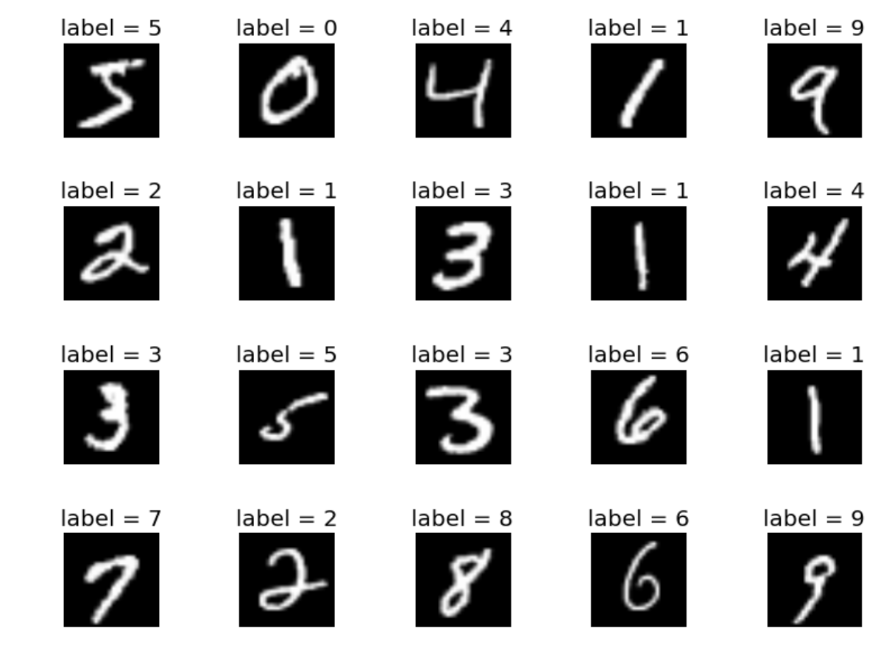

# MNIST Handwritten digit recogntion
This project implements a classification task on the MNIST dataset with a Convolutional Neural Network. 

## Dataset
We will be using the MNIST dataset. It contains 70,000 images of handwritten digits: 60,000 
for training and 10,000 for testing. The images are grayscale, 28x28 pixels, and centered to
reduce preprocessing and get started quicker.



### Hyperparameters
```
learning_rate = 0.01
momentum = 0.5
```

## Usage

Training/Evaluation script

```shell
usage: cli.py [-h] [--ckpf CKPF] [--train] [--evaluate] [--image_path IMAGE_PATH]

MNIST Example

optional arguments:
  -h, --help            show this help message and exit
  --ckpf CKPF           path to model checkpoint file (to continue training)
  --train               training a ConvNet model on MNIST dataset
  --evaluate            evaluate a [pre]trained model
  --image_path IMAGE_PATH
                        image to evaluate

```

## Training

```
  python -m cli --train
```

After training for 9 epochs:

```
Train Accuracy: 96%
Test Accuracy: 99

Train Epoch: 9 [57600/60000 (96%)]      Loss: 0.001098
Test set: Avg. loss: 0.0294, Accuracy: 9914/10000 (99%)
```


## Evaluation

We will evaluate the training model with this image:


```
python -m cli --evaluate --ckpf data/mnist.pth --image_path 7.png
```

Output:

```
Predicted Label - 7
```